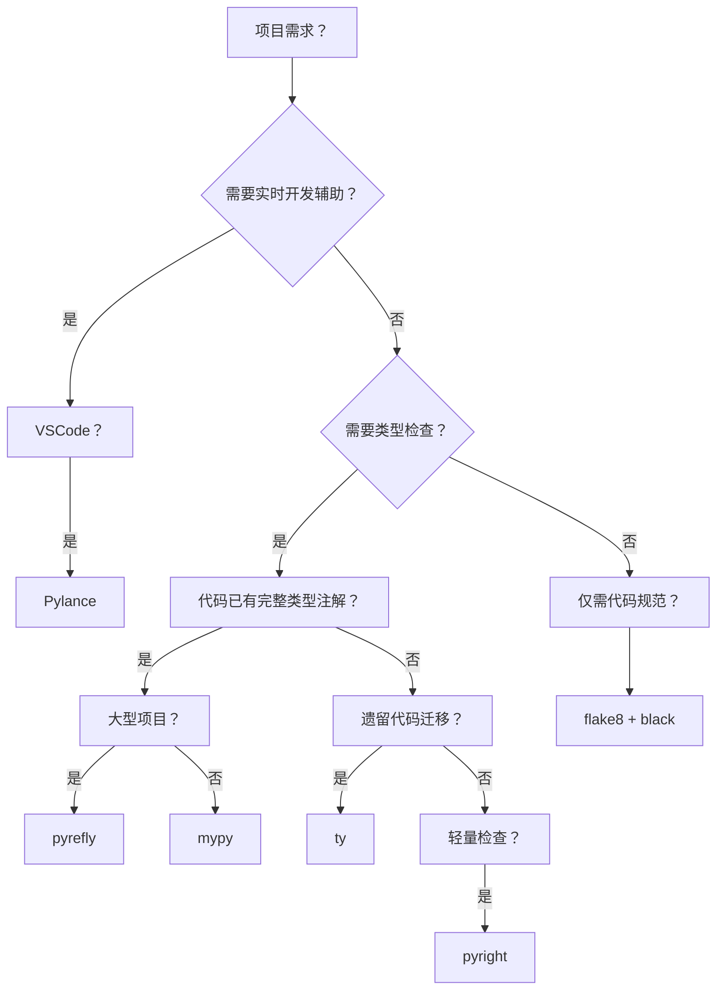

# Python代码检查工具对比分析

==================================================

以下是针对 **Pylance**、**flake8**、**mypy**、**pyright**、**ty** 和 **pyrefly** 的全面对比，结合功能定位、技术特性、性能表现及适用场景，基于最新技术动态（截至 2025 年 7 月）整理：

---

### 🔧 一、功能定位与核心能力对比
| 工具        | 类型               | 核心目标                          | 关键技术特性                                                                 |
|-------------|--------------------|----------------------------------|-----------------------------------------------------------------------------|
| **Pylance** | 语言服务器         | 提供实时开发辅助（补全、类型检查等） | 基于 Pyright 内核，集成 VSCode 深度优化；支持文档字符串、自动导入、语义高亮等 |
| **flake8**  | 静态代码检查工具   | 代码风格检查 + 简单逻辑错误检测    | 整合 pycodestyle（PEP8）、pyflakes（逻辑错误）、mccabe（圈复杂度） |
| **mypy**    | 静态类型检查器     | 强制类型注解合规性检查             | 支持泛型、类型别名、递归类型；需显式类型注解                     |
| **pyright** | 静态类型检查器     | 高性能类型检查 + 语言服务支持      | 用 TypeScript 编写，不依赖 Python 环境；支持增量检查和泛型推断 |
| **ty**      | 静态类型检查器     | 渐进式类型保证 + 高性能            | Rust 内核；支持交叉类型（`&`）、否定类型（`~`）；函数级增量检查（Salsa 框架） |
| **pyrefly** | 静态类型检查器     | 极限性能 + 激进类型推断            | Rust 内核；模块级增量检查；自动推断未注解变量类型（如空容器推导为 `list[…]`） |

> **注**：  
> - Pylance 是 **Pyright 的超集**，专为 VSCode 优化，提供语言服务扩展功能。  
> - ty 和 pyrefly 均为 **2025 年新锐工具**，基于 Rust 开发，性能显著优于传统工具。

---

### ⚡ 二、性能与设计哲学对比
#### **性能表现**（基于 PyTorch 全库检查测试）
| 工具        | 耗时    | 速度对比（基准：mypy） | 增量检查机制         |
|-------------|---------|------------------------|---------------------|
| **ty**      | 4.039s  | 65× mypy              | 函数级（Salsa 依赖图） |
| **pyrefly** | 13.029s | 20× mypy              | 模块级依赖树更新      |
| **pyright** | 262s    | 1×（基准）            | 文件级增量           |
| **mypy**    | >260s   | -                     | 无原生增量支持       |

#### **设计哲学差异**
| 特性                | ty                          | pyrefly                     |
|---------------------|-----------------------------|-----------------------------|
| **类型推断策略**    | 渐进式保证（移除注解不报错） | 激进推断（最大化推导未注解变量） |
| **动态类型处理**    | 标记为 `Unknown` 允许操作    | 严格禁止潜在不安全操作       |
| **泛型支持**        | 需显式声明泛型参数           | 自动推导非显式泛型           |
| **错误提示友好性**  | 关联错误位置与修复建议       | 传统风格提示                 |

> **示例**：  
> ```python
> # ty 的渐进式保证：允许未注解变量动态赋值
> class Data: value = None
> obj = Data()
> obj.value = 100  # ✅ 推断为 Unknown | None
> 
> # pyrefly 的激进推断：禁止未定义属性
> obj.new_field = 42  # ❌ 报错（除非显式注解）
> ```

---

### 🎯 三、适用场景与工具选择指南
| 场景                     | 推荐工具              | 理由                                                                 |
|--------------------------|-----------------------|---------------------------------------------------------------------|
| **实时开发辅助**         | Pylance（VSCode）     | 深度集成 IDE，提供补全、类型诊断等实时反馈 |
| **代码规范与风格检查**   | flake8 + black        | 自动化格式与基础逻辑检查的最佳组合                     |
| **强类型项目检查**       | mypy                  | 社区成熟，对复杂类型系统支持最全面                     |
| **大型遗留代码迁移**     | ty                    | 渐进式类型保证降低迁移成本；函数级增量检查提升效率 |
| **超大规模代码库**       | pyrefly              | 模块级增量优化；激进推断减少显式注解负担（适合 >100 万行项目） |
| **高性能轻量类型检查**   | pyright               | 不依赖 Python 环境，适合 CLI 或 CI 流水线              |

---

### 🔄 四、工具协作方案
#### 典型工作流示例：


#### 配置建议：
- **VSCode 用户**：Pylance（语言服务） + flake8 扩展（代码规范） + ty/pyrefly 扩展（类型检查）  
- **CI/CD 流水线**：  
  ```yaml
  steps:
    - run: black .  # 自动格式化
    - run: flake8 . # 代码规范
    - run: ty check .  # 类型检查（或 pyrefly/pyright）
  ```

---

### 💎 五、总结：核心优势与未来趋势
| 工具        | 核心优势                              | 局限性                | 未来方向               |
|-------------|---------------------------------------|-----------------------|------------------------|
| **Pylance** | IDE 集成体验最佳                      | 仅限 VSCode           | 持续优化 AI 补全       |
| **flake8**  | 轻量可配置，规则明确                  | 无类型检查能力        | 插件生态扩展           |
| **mypy**    | 类型系统最严谨                        | 性能瓶颈明显          | 优化增量检查           |
| **pyright** | 跨平台 CLI 友好                       | 功能弱于 Pylance      | 语言服务功能增强       |
| **ty**      | 渐进式迁移 + 函数级增量               | Alpha 阶段功能未完善  | 依赖类型支持 |
| **pyrefly** | 极致性能 + 模块级增量                 | 激进推断可能误报      | Python 3.12 全语法支持 |

> **趋势预测**：  
> - **企业级项目**：ty 与 pyrefly 将逐步替代 mypy/pyright，尤其重视性能与迁移成本的项目。  
> - **开发者体验**：Pylance 仍为 VSCode 开发首选，未来可能集成 ty/pyrefly 作为底层引擎。  
> - **工具链融合**：Ruff（Astral 出品）可能整合 ty，形成 “格式化（Ruff） + 类型检查（ty）” 一体化方案。

---

### 📊 六、决策树：如何选择工具？


通过以上对比，可根据项目规模、类型化程度、性能需求选择最适配的工具组合。
