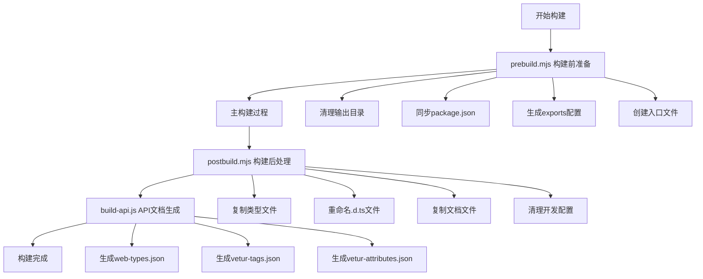

# PrimeVue 构建系统完整指南

> **摘要**：本文深入解析 PrimeVue 的完整构建系统，详细介绍构建前准备、主构建过程、构建后处理和 API 文档生成等各个环节，帮助开发者理解大型 Vue 组件库的构建流程。

## 概述

PrimeVue 使用一套完整的构建系统来管理多包项目的构建、API 文档生成和发布准备。本文档将详细介绍整个构建流程。

## 构建流程概览



## 构建脚本详解

### 1. prebuild.mjs - 构建前准备

#### 作用
在构建开始前执行准备工作，包括环境清理、信息同步和动态配置生成。

#### 主要功能
- **清理输出目录**：删除之前的构建结果
- **同步 package.json**：从主包同步版本等信息
- **动态生成导出配置**：自动扫描组件目录，生成 package.json 的 exports 字段
- **生成入口文件**：创建 UMD 和 ESM 格式的入口文件

#### 工作流程
```javascript
// 1. 清理环境
removeBuild(import.meta.url);

// 2. 同步信息
updatePackageJson(pkg);

// 3. 扫描组件目录，生成 exports 配置
exports[`./${folderName}`] = `./${INPUT_DIR}${folderName}/${file}`;
exports[`./${folderName}/style`] = `./${INPUT_DIR}${folderName}/style/${file}`;

// 4. 生成入口文件
fs.writeFileSync(INPUT_DIR + 'umd/primevue.js', modules.umd.join(''));
fs.writeFileSync(INPUT_DIR + 'index.js', modules.esm.join(''));
```

#### 输出示例
**package.json exports 配置**：
```json
{
  "exports": {
    "./button": "./src/components/button/Button.vue",
    "./button/style": "./src/components/button/style/ButtonStyle.js",
    "./dialog": "./src/components/dialog/Dialog.vue",
    "./dialog/style": "./src/components/dialog/style/DialogStyle.js",
    "./*": "./*"
  }
}
```

**UMD 入口文件**：
```javascript
/***************** PrimeVue (Auto-Generated) *****************/

// Button
export * from '../button/Button.vue';
export { default as Button } from '../button/Button.vue';
export * from '../button/style/ButtonStyle.js';
export { default as ButtonStyle } from '../button/style/ButtonStyle.js';
```

### 2. postbuild.mjs - 构建后处理

#### 作用
在构建完成后执行清理和整理工作，准备发布包。

#### 主要功能
- **复制类型声明文件**：将 .d.ts 和 .vue 文件复制到输出目录
- **标准化文件名**：将所有 .d.ts 文件重命名为 index.d.ts
- **复制必要文件**：复制 package.json、README.md、LICENSE.md
- **清理配置**：移除开发时的配置，准备发布

#### 工作流程
```javascript
// 1. 复制类型文件
copyDependencies(INPUT_DIR, OUTPUT_DIR, '/style');

// 2. 标准化类型文件名
renameDTSFile(OUTPUT_DIR, 'index');

// 3. 复制文档文件
fs.copySync('package.json', `${OUTPUT_DIR}/package.json`);
fs.copySync('README.md', `${OUTPUT_DIR}/README.md`);
fs.copySync('LICENSE.md', `${OUTPUT_DIR}/LICENSE.md`);

// 4. 清理发布配置
clearPackageJson(`${OUTPUT_DIR}/package.json`);
```

### 3. build-api.js - API 文档生成器

#### 作用
为 IDE 和编辑器生成代码智能提示文件。

#### 主要功能
- **生成 web-types.json**：为 JetBrains IDE（WebStorm、IntelliJ）提供 Vue 组件智能提示
- **生成 vetur-tags.json**：为 Vetur（VS Code Vue 扩展）提供标签智能提示
- **生成 vetur-attributes.json**：为 Vetur 提供属性智能提示

#### 工作流程
```javascript
// 1. 扫描组件目录
files.forEach((file) => {
    const { name } = path.parse(file);
    try {
        fileModules[name] = require(`./components/${name}`);
    } catch {}
});

// 2. 生成各种格式的智能提示文件
Object.keys(fileModules).forEach((p) => {
    const component = fileModules[p][p];
    if (component) {
        createWebTypes(component);      // JetBrains IDE
        createVeturTags(component);     // VS Code Vetur 标签
        createVeturAttributes(component); // VS Code Vetur 属性
    }
});

// 3. 输出文件
fs.writeFileSync('web-types.json', webTypesJson);
fs.writeFileSync('vetur-tags.json', veturTagsJson);
fs.writeFileSync('vetur-attributes.json', veturAttributesJson);
```

#### 输出示例
**web-types.json**：
```json
{
  "$schema": "https://raw.githubusercontent.com/JetBrains/web-types/master/schema/web-types.json",
  "framework": "vue",
  "name": "PrimeVue",
  "version": "4.0.0",
  "contributions": {
    "html": {
      "tags": [
        {
          "name": "Button",
          "doc-url": "https://primevue.org/button",
          "description": "Button component",
          "attributes": [
            {
              "name": "label",
              "description": "Text of the button",
              "value": { "kind": "expression", "type": "string" }
            }
          ]
        }
      ]
    }
  }
}
```

**vetur-tags.json**：
```json
{
  "Button": {
    "description": "Button component",
    "attributes": ["label", "icon", "disabled"]
  }
}
```

## 完整构建流程

### 步骤详解

#### 阶段 1: 构建前准备 (prebuild.mjs)
1. **环境清理**：删除之前的构建输出
2. **信息同步**：从主包同步版本、作者等信息
3. **组件扫描**：遍历组件目录，发现所有组件
4. **配置生成**：动态生成 package.json 的 exports 配置
5. **入口文件**：生成 UMD 和 ESM 两种格式的入口文件

#### 阶段 2: 主构建过程
这个阶段由外部构建工具（如 Rollup、Webpack）执行，处理：
- TypeScript 编译
- Vue 单文件组件处理
- 代码打包和优化
- CSS 处理

#### 阶段 3: 构建后处理 (postbuild.mjs)
1. **类型文件处理**：复制和重命名 TypeScript 声明文件
2. **文档复制**：复制 README、LICENSE 等文件
3. **配置清理**：移除开发时的配置，优化发布包

#### 阶段 4: API 文档生成 (build-api.js)
1. **组件定义加载**：动态加载所有组件的 API 定义
2. **智能提示生成**：为不同 IDE 生成相应格式的智能提示文件
3. **文档链接**：为每个组件添加官方文档链接

## 开发指南

### 添加新组件

#### 1. 创建组件目录结构
```
src/components/newcomponent/
├── NewComponent.vue        # 主组件
├── style/
│   └── NewComponentStyle.js # 样式文件
└── index.js               # 组件定义（用于API生成）
```

#### 2. 组件定义示例 (index.js)
```javascript
export default {
    name: 'NewComponent',
    description: '新组件的描述',
    'doc-url': 'newcomponent',  // 可选，默认使用组件名
    props: [
        {
            name: 'value',
            type: 'any',
            default: 'null',
            description: '组件的值'
        },
        {
            name: 'disabled',
            type: 'boolean',
            default: 'false',
            description: '是否禁用组件'
        }
    ],
    events: [
        {
            name: 'change',
            description: '值改变时触发',
            arguments: [
                {
                    name: 'value',
                    type: 'any',
                    description: '新的值'
                }
            ]
        }
    ],
    slots: [
        {
            name: 'default',
            description: '默认插槽内容'
        },
        {
            name: 'header',
            description: '头部插槽内容'
        }
    ]
};
```

#### 3. 自动化处理
构建脚本会自动：
- 在 package.json 中添加导出配置
- 在入口文件中添加导出语句  
- 生成 IDE 智能提示配置
- 创建文档链接

### 环境变量配置

构建脚本依赖以下环境变量：

```bash
# 在 package.json scripts 中设置
"scripts": {
  "prebuild": "INPUT_DIR=src/ OUTPUT_DIR=dist/ node scripts/prebuild.mjs",
  "postbuild": "INPUT_DIR=src/ OUTPUT_DIR=dist/ node scripts/postbuild.mjs"
}
```

或使用 .env 文件：
```bash
INPUT_DIR=src/
OUTPUT_DIR=dist/
```

### 完整构建命令

```json
{
  "scripts": {
    "clean": "rimraf dist",
    "prebuild": "INPUT_DIR=src/ OUTPUT_DIR=dist/ node scripts/prebuild.mjs",
    "build": "rollup -c rollup.config.js",
    "postbuild": "INPUT_DIR=src/ OUTPUT_DIR=dist/ node scripts/postbuild.mjs",
    "build-api": "INPUT_DIR=src/ OUTPUT_DIR=dist/ node scripts/build-api.js",
    "build:complete": "npm run clean && npm run prebuild && npm run build && npm run postbuild && npm run build-api",
    "build:watch": "npm run prebuild && rollup -c rollup.config.js --watch"
  }
}
```

## 最佳实践

### ✅ 推荐做法

1. **组件定义完整性**
   - 确保每个组件都有完整的 API 定义
   - 包含所有 props、events、slots 的详细描述
   - 提供准确的类型信息

2. **命名一致性**
   - 组件文件名、目录名、导出名保持一致
   - 使用 PascalCase 命名组件
   - 样式文件名遵循 `{ComponentName}Style.js` 格式

3. **样式分离**
   - 样式文件独立于主组件文件
   - 支持按需加载样式
   - 保持样式模块化

4. **文档同步**
   - API 定义与实际组件实现保持同步
   - 及时更新组件描述和示例
   - 确保文档链接有效

5. **版本管理**
   - 统一在主 package.json 中管理版本
   - 让构建脚本自动同步版本信息
   - 避免手动维护多个版本号

### ❌ 避免做法

1. **手动维护导出**
   - 不要手动编辑自动生成的入口文件
   - 不要直接修改 package.json 的 exports 字段
   - 依赖构建脚本自动生成配置

2. **跳过构建步骤**
   - 每个构建阶段都有其重要作用
   - 不要省略 prebuild 或 postbuild 步骤
   - 确保 API 文档生成步骤执行

3. **硬编码路径**
   - 使用环境变量而不是硬编码路径
   - 保持构建脚本的灵活性
   - 支持不同的项目结构

4. **忽略类型定义**
   - 确保每个组件都有 TypeScript 类型定义
   - 不要忽略 .d.ts 文件的生成和复制
   - 保持类型安全

## 故障排除

### 常见问题及解决方案

#### Q: 新组件没有出现在 IDE 智能提示中？
**可能原因**：
- 组件定义文件缺失或格式错误
- build-api.js 未正确执行
- IDE 缓存未刷新

**解决方案**：
```bash
# 1. 检查组件定义文件
cat src/components/newcomponent/index.js

# 2. 重新生成 API 文档
npm run build-api

# 3. 重启 IDE 并清理缓存
```

#### Q: 构建后类型文件缺失？
**可能原因**：
- postbuild.mjs 未正确执行
- copyDependencies 函数调用失败
- 输出目录权限问题

**解决方案**：
```bash
# 1. 检查输出目录
ls -la dist/

# 2. 重新执行 postbuild
npm run postbuild

# 3. 检查文件权限
chmod -R 755 dist/
```

#### Q: package.json exports 配置错误？
**可能原因**：
- 组件目录结构不符合约定
- prebuild.mjs 扫描失败
- 环境变量未正确设置

**解决方案**：
```bash
# 1. 检查环境变量
echo $INPUT_DIR $OUTPUT_DIR

# 2. 验证目录结构
find src/components -type f -name "*.vue"

# 3. 重新执行 prebuild
npm run prebuild
```

#### Q: 智能提示文件格式错误？
**可能原因**：
- 组件定义中的数据格式不正确
- JSON 序列化失败
- 文件写入权限问题

**解决方案**：
```bash
# 1. 验证 JSON 格式
node -e "console.log(JSON.parse(require('fs').readFileSync('dist/web-types.json', 'utf8')))"

# 2. 检查组件定义格式
node -c scripts/build-api.js

# 3. 重新生成文件
rm dist/*.json && npm run build-api
```

### 调试技巧

#### 1. 添加调试日志
```javascript
// 在 prebuild.mjs 中
console.log('扫描到的组件:', Object.keys(exports));
console.log('生成的 UMD 模块数量:', modules.umd.length);

// 在 build-api.js 中
console.log('加载的组件定义:', Object.keys(fileModules));
console.log('生成的智能提示标签数量:', Object.keys(veturTags).length);
```

#### 2. 检查中间文件
```bash
# 检查生成的入口文件
cat src/index.js
cat src/umd/primevue.js

# 检查 package.json exports
node -e "console.log(require('./package.json').exports)"

# 验证智能提示文件
jq . dist/web-types.json
jq . dist/vetur-tags.json
```

#### 3. 分步骤调试
```bash
# 单独执行各个步骤
npm run clean
npm run prebuild    # 检查是否正常
npm run build      # 检查是否正常  
npm run postbuild  # 检查是否正常
npm run build-api  # 检查是否正常
```

## 性能优化

### 构建性能优化

1. **增量构建**
   - 只重新构建改变的组件
   - 缓存中间结果
   - 使用文件监视模式

2. **并行处理**
   - 并行处理多个组件
   - 异步文件操作
   - 优化文件复制

3. **缓存策略**
   - 缓存组件定义解析结果
   - 复用智能提示文件
   - 避免重复计算

### 输出优化

1. **文件大小**
   - 移除不必要的注释
   - 压缩 JSON 输出
   - 优化文件结构

2. **加载性能**
   - 支持树摇优化
   - 按需加载样式
   - 模块化导出

## 总结

PrimeVue 构建系统通过三个关键脚本实现了：

- 🔄 **完全自动化** - 从组件发现到发布准备的全流程自动化
- 📝 **智能提示支持** - 为主流 IDE 和编辑器提供完整的智能提示
- 🏗️ **动态配置生成** - 自动发现新组件并生成相应配置
- 🧹 **清理和优化** - 自动清理开发配置，优化发布包体积
- 📚 **类型安全** - 完整的 TypeScript 类型定义支持
- 🔧 **灵活配置** - 通过环境变量支持不同的项目结构

这套系统大大简化了多组件库的维护工作，提高了开发效率，确保了构建质量和开发体验的一致性。新加入的开发者只需要遵循组件结构约定，其余工作都会由构建系统自动完成。
