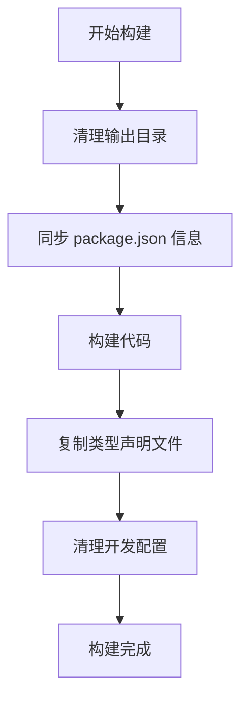

# PrimeVue 构建系统说明文档

## 概述

PrimeVue 采用 **monorepo** 架构，包含多个独立的子包。为了确保各个子包的 `package.json` 信息一致性和构建流程的标准化，我们开发了构建辅助工具 `build-helper.mjs`。

## 项目结构

```
primevue/
├── package.json                    # 🏠 主 package.json（信息源）
├── scripts/
│   └── build-helper.mjs           # 🔧 构建辅助工具
└── packages/
    ├── primevue/
    │   └── package.json           # 📦 子包 A
    ├── themes/
    │   └── package.json           # 📦 子包 B
    └── icons/
        └── package.json           # 📦 子包 C
```

## 核心问题

### 问题 1：信息同步
各个子包的 `package.json` 可能信息不完整或不一致：

**主包 package.json（完整信息）**
```json
{
  "name": "primevue",
  "version": "4.0.0",
  "author": "PrimeTek",
  "homepage": "https://primevue.org",
  "license": "MIT",
  "repository": {
    "type": "git",
    "url": "https://github.com/primefaces/primevue.git"
  }
}
```

**子包 package.json（信息残缺）**
```json
{
  "name": "@primevue/themes",
  "main": "index.js",
  "types": "index.d.ts"
  // ❌ 缺少 version、author、homepage 等信息
}
```

### 问题 2：开发配置污染
开发时的配置不应该出现在发布包中：

```json
{
  "name": "@primevue/themes",
  "scripts": {
    "dev": "vite",           // ❌ 发布时不需要
    "build": "rollup"        // ❌ 发布时不需要
  },
  "devDependencies": {       // ❌ 发布时不需要
    "vite": "^4.0.0",
    "rollup": "^3.0.0"
  },
  "publishConfig": {
    "directory": "dist",     // ❌ 发布时不需要
    "linkDirectory": true    // ❌ 发布时不需要
  }
}
```

## 解决方案

### 构建辅助工具功能

#### 1. 路径解析 - `resolvePath()`
```javascript
// 自动解析构建所需的各种路径
const paths = resolvePath();
// 返回：__dirname, __workspace, INPUT_PATH, OUTPUT_PATH 等
```

#### 2. 信息同步 - `updatePackageJson()`
```javascript
// 将主 package.json 的信息同步到子包
updatePackageJson('./packages/themes/package.json');
```

**同步的字段：**
- `version` - 版本号
- `author` - 作者信息  
- `homepage` - 主页地址
- `license` - 许可证
- `repository` - 仓库信息
- `bugs` - 问题跟踪
- `engines` - Node.js 版本要求

#### 3. 配置清理 - `clearPackageJson()`
```javascript
// 清理发布时不需要的开发配置
clearPackageJson('./packages/themes/package.json');
```

**清理的字段：**
- `scripts` - 开发脚本
- `devDependencies` - 开发依赖
- `publishConfig.directory` - 发布目录配置
- `publishConfig.linkDirectory` - 链接目录配置

#### 4. 文件操作
- `removeBuild()` - 清理构建目录
- `copyDependencies()` - 复制 TypeScript 声明文件和 Vue 文件
- `renameDTSFile()` - 重命名 TypeScript 声明文件

## 构建流程

### 标准构建流程



### 示例构建脚本

```javascript
// filepath: packages/themes/build.mjs
import { updatePackageJson, clearPackageJson, removeBuild } from '../../scripts/build-helper.mjs';

// 1. 清理之前的构建
removeBuild();

// 2. 同步主包信息
updatePackageJson('./package.json');

// 3. 执行具体构建逻辑
// ... 你的构建代码 ...

// 4. 清理开发配置
clearPackageJson('./package.json');
```

## 开发指南

### 新增子包时

1. **创建基础 package.json**
```json
{
  "name": "@primevue/new-package",
  "main": "index.js",
  "types": "index.d.ts"
}
```

2. **创建构建脚本**
```javascript
// filepath: packages/new-package/build.mjs
import { updatePackageJson, clearPackageJson } from '../../scripts/build-helper.mjs';

updatePackageJson('./package.json');
// ... 构建逻辑 ...
clearPackageJson('./package.json');
```

3. **添加到主包的构建流程**

### 修改版本号时

只需要更新主 `package.json` 的版本号，构建时会自动同步到所有子包。

### 环境变量

构建脚本依赖以下环境变量：
- `INPUT_DIR` - 输入目录
- `OUTPUT_DIR` - 输出目录

## 最佳实践

### ✅ 推荐做法
- 所有版本、作者等元信息只在主 `package.json` 中维护
- 子包只包含包特有的配置（name、main、types 等）
- 使用构建辅助工具确保信息同步

### ❌ 避免做法
- 不要在子包中手动维护版本号
- 不要在子包中重复设置 author、homepage 等通用信息
- 不要跳过 `clearPackageJson()` 步骤

## 故障排除

### 常见问题

**Q: 子包版本号不一致？**
A: 确保构建脚本中调用了 `updatePackageJson()`

**Q: 发布包包含开发依赖？**
A: 确保构建脚本中调用了 `clearPackageJson()`

**Q: 构建路径错误？**
A: 检查环境变量 `INPUT_DIR` 和 `OUTPUT_DIR` 是否正确设置

### 调试技巧

```javascript
// 查看解析的路径
const paths = resolvePath();
console.log('构建路径:', paths);

// 检查 package.json 同步结果
updatePackageJson('./package.json');
console.log('同步后的 package.json:', JSON.parse(fs.readFileSync('./package.json', 'utf8')));
```

## 总结

通过构建辅助工具，我们实现了：
- 📋 **统一管理** - 所有包的元信息集中维护
- 🔄 **自动同步** - 构建时自动同步版本等信息  
- 🧹 **自动清理** - 发布前自动移除开发配置
- 🚀 **标准化流程** - 所有子包使用相同的构建模式

这套机制大大简化了多包项目的维护工作，确保了发布质量的一致性。
