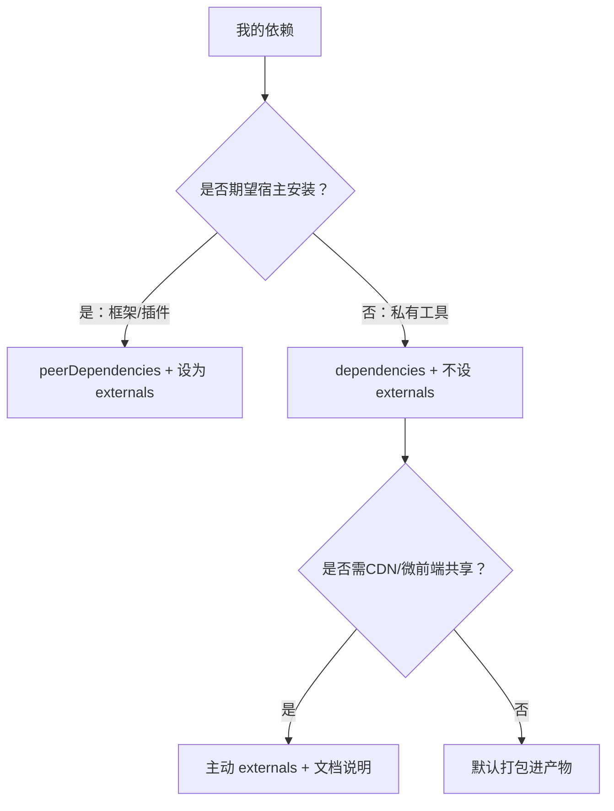

> **摘要**：本文深入分析 npm 中 dependencies 和 peerDependencies 的核心区别，包括安装行为、打包影响、版本冲突处理等关键方面，提供实用的依赖管理最佳实践，帮助开发者避免常见的依赖问题。

==================================================

peerDependencies 和 dependencies 到底有什么区别

==================================================

在 npm 的 `package.json` 文件中，`dependencies` 和 `peerDependencies` 都用于管理依赖，但它们的用途和行为有本质区别：

---

### **1. dependencies**
- **用途**：声明当前包**直接依赖**的第三方库。  
- **安装行为**：  
  - 当用户安装你的包时，这些依赖会被**自动安装**到你的 `node_modules` 中。  
  - 如果依赖库有多个版本，npm/yarn 会通过嵌套安装解决冲突（不同包可使用各自兼容的版本）。  
- **适用场景**：  
  你的包**运行时必须**的库（例如 `lodash`、`axios` 等）。  
- **示例**：  
  ```json
  {
    "dependencies": {
      "lodash": "^4.17.0"
    }
  }
  ```

---

### **2. peerDependencies**
- **用途**：声明当前包**需要宿主环境提供**的依赖（通常是共享库）。  
- **安装行为**：  
  - **不会自动安装**这些依赖！  
  - 如果用户安装你的包时，宿主环境**没有安装**指定的依赖（或版本不兼容），会抛出警告（npm <7）或错误（npm ≥7）。  
  - 用户必须**手动安装**这些依赖到宿主项目中。  
- **设计目的**：避免**重复安装**和**版本冲突**（强制共享同一份依赖）。  
- **适用场景**：  
  - 插件类库（如 `webpack-plugin` 需要共享宿主项目的 `webpack`）。  
  - 组件库（如 React 组件库需要共享宿主项目的 `react`）。  
- **示例**：  
  ```json
  {
    "peerDependencies": {
      "react": ">=16.8.0"
    }
  }
  ```

---

### **关键区别总结**
| 特性                | dependencies                  | peerDependencies                     |
|---------------------|------------------------------|--------------------------------------|
| **安装行为**        | 自动安装到当前包 `node_modules` | 不自动安装，需宿主环境提供             |
| **版本冲突解决**    | 允许嵌套多版本                | 强制宿主环境共享单版本               |
| **适用场景**        | 私有依赖（仅当前包需要）       | 公共依赖（需与宿主共享）             |
| **用户责任**        | 无需手动操作                  | 必须确保宿主环境安装正确版本         |
| **典型用例**        | `axios`, `lodash` 等工具库    | React 组件库、Webpack 插件等         |

---

### **为什么需要 peerDependencies？**
假设你开发一个 React 组件库：
- 如果将其放入 `dependencies`：  
  用户项目中可能安装**两份 React**（你的组件库内一份 + 用户项目一份），导致打包体积增大，甚至引发 React 上下文错乱。  
- 使用 `peerDependencies`：  
  强制组件库与宿主项目**共享同一份 React**，避免重复安装和版本冲突。

---

### **npm 版本差异**
- **npm v3-v6**：只对缺失的 `peerDependencies` 输出警告，不阻塞安装。  
- **npm v7+**：自动安装 `peerDependencies`（但要求版本范围兼容），不兼容则报错。  
- **Yarn**：默认不安装，需配合 `yarn install --flat` 或显式添加到宿主依赖。

---

### **最佳实践**
1. **库/插件开发者**：  
   - 将核心框架（如 React、Vue、Webpack）放入 `peerDependencies` + `devDependencies`（用于本地测试）。  
   - 私有工具库放入 `dependencies`。  
2. **应用开发者**：  
   - 直接管理所有依赖（包括 `peerDependencies` 要求的库），无需特殊操作。

通过正确使用两者，可显著避免依赖冲突和冗余安装问题。

==================================================

它们在打包的时候有没有什么区别

==================================================

在打包过程中（如使用 Webpack、Rollup 等工具），`dependencies` 和 `peerDependencies` 的处理方式有显著区别，直接影响最终产物的体积和运行方式：

---

### **1. dependencies 的打包行为**
- **默认打包进产物**  
  工具会将 `dependencies` 中的模块视为**私有依赖**，直接打包进最终输出文件（如 `dist/main.js`）。
- **重复打包风险**  
  如果多个库依赖同一个包（如 `lodash`），每个库都会将自己的 `lodash` 打包进产物，导致：
  ```bash
  final-bundle.js
  ├── LibraryA 的 lodash v4.17.0 (50KB)
  └── LibraryB 的 lodash v4.17.0 (50KB)  # 重复！
  ```
- **适用场景**  
  适合**不期望宿主环境提供**的私有工具库（如内部封装的 `utils` 等）。

---

### **2. peerDependencies 的打包行为**
- **默认排除在产物外**  
  打包工具会将 `peerDependencies` 视为**外部依赖**（externals），**不会打包进最终产物**。
- **依赖宿主环境提供**  
  在代码中保留 `import` 语句，运行时从宿主环境的 `node_modules` 加载：
  ```js
  // 打包后代码保留原始导入
  import React from 'react'; // 从宿主项目获取
  ```
- **避免重复打包**  
  确保多个库共享宿主环境的同一份依赖：
  ```bash
  final-bundle.js
  ├── YourComponentLib (不含 React)
  └── HostProject 的 react v18.2.0 (120KB)  # 仅一份
  ```

---

### **关键打包差异对比**
| 特性                     | dependencies                          | peerDependencies                     |
|--------------------------|---------------------------------------|--------------------------------------|
| **是否打包进产物**       | ✅ 是                                 | ❌ 否（默认）                        |
| **打包工具配置**         | 自动包含                              | 需配为 `externals` (或自动识别)      |
| **产物体积影响**         | 增大体积（可能重复）                  | 不增加体积                           |
| **运行时依赖来源**       | 当前包的 `node_modules`               | 宿主项目的 `node_modules`            |
| **典型场景**             | 私有工具函数、内部库                  | 框架组件(React/Vue)、插件(Webpack)   |

---

### **打包配置示例（Webpack）**
```js
// webpack.config.js（组件库配置）
module.exports = {
  externals: {
    // 关键：将 peerDependencies 设为外部依赖
    react: 'react',
    'react-dom': 'react-dom'
  }
};
```

---

### **为什么 peerDependencies 需要特殊打包处理？**
以 React 组件库为例：
1. **避免重复打包**  
   若将 React 打包进组件库，用户项目会同时存在：
   - 组件库内的 React (50KB)
   - 用户项目的 React (50KB)
   → **总体积增加 100KB**

2. **避免上下文冲突**  
   React 依赖全局上下文（如 `React.createContext`），多个 React 实例会导致：
   ```js
   // 用户项目
   import React from 'react'; // 版本 18
   
   // 组件库内部
   import React from 'react'; // 版本 17 (已打包进组件)
   
   // 导致 Context、Hooks 等 API 失效
   ```

---

### **peerDependencies 的打包注意事项**
1. **开发环境特殊处理**  
   在组件库的本地开发中，需将 `peerDependencies` 安装到 `devDependencies`：
   ```json
   {
     "peerDependencies": {
       "react": ">=16.8"
     },
     "devDependencies": {
       "react": "^18.2.0" // 用于本地测试和打包
     }
   }
   ```

2. **Tree Shaking 优化**  
   当 `peerDependencies` 设为外部依赖时，宿主项目的打包工具可对共享库做 Tree Shaking。

3. **动态依赖警告**  
   若代码动态加载 peer 依赖（如 `require('react/' + path)`），需显式配置 externals：
   ```js
   // Webpack 配置
   externals: {
     react: {
       commonjs: 'react',
       commonjs2: 'react',
       amd: 'react'
     }
   }
   ```

---

### **总结：打包决策指南**
| **你的包类型**       | **依赖类型**          | **打包建议**                         |
|----------------------|-----------------------|--------------------------------------|
| 应用项目             | 所有依赖              | 全部打包进产物                       |
| 公共组件库/插件      | 框架(React/Vue 等)    | peerDependencies + 设为 externals    |
| 公共组件库/插件      | 私有工具(如内部 utils)| dependencies + 打包进产物            |
| 独立运行的工具库     | 所有必需依赖          | dependencies + 打包进产物            |

正确区分两者可避免 **“打包体积膨胀”** 和 **“多实例冲突”** 两大核心问题。

==================================================

看起来这个把 peerDependencies 设为 externals 的步骤是手动执行的，那如果一般的 dependencies 也设为 externals，打包的时候有区别吗

==================================================

你说得非常对！**将 `peerDependencies` 设为 `externals` 确实是手动配置的**，而 `dependencies` 默认是会被打包的。但如果**主动将 `dependencies` 也设为 `externals`**，打包行为会发生变化，但运行时会产生关键差异。下面通过对比帮你彻底理清：

---

### 配置对比实验（假设打包工具为 Webpack）
#### 场景设定：
```json
// package.json
{
  "name": "my-library",
  "dependencies": {
    "lodash": "^4.17.0"     // 私有工具
  },
  "peerDependencies": {
    "react": ">=16.8"       // 共享框架
  }
}
```

#### 1. **默认行为（不配置 externals）**
| 依赖类型          | 是否打包进产物 | 运行时来源               | 风险                     |
|-------------------|----------------|--------------------------|--------------------------|
| `dependencies`    | ✅ 是          | 当前库的 `node_modules`  | 无                       |
| `peerDependencies`| ❌ 否          | 宿主项目的 `node_modules`| **宿主未安装则报错**     |

#### 2. **手动将 `lodash` (dependencies) 设为 externals**
```js
// webpack.config.js
module.exports = {
  externals: {
    lodash: 'lodash'  // 关键：强制外部化
  }
};
```

| 依赖类型          | 是否打包进产物 | 运行时来源               | 风险                                |
|-------------------|----------------|--------------------------|-------------------------------------|
| `dependencies`    | ❌ 否          | 宿主项目的 `node_modules`| **宿主未安装则报错**                |
| `peerDependencies`| ❌ 否          | 宿主项目的 `node_modules`| **宿主未安装则报错**                |

---

### 关键区别解析
#### 🔥 核心差异：**安装责任方不同**
| 依赖类型          | 设为 externals 后的实际行为                          | 责任方       |
|-------------------|------------------------------------------------------|--------------|
| `peerDependencies`| 符合预期，宿主**必须安装**（本来就是宿主责任）       | ✅ 合理      |
| `dependencies`    | **转嫁责任**，宿主**意外承担**了本不该安装的依赖     | ❌ 不合理    |

#### ⚠️ 风险示意图：
```mermaid
graph LR
    A[宿主项目] --> B[使用 my-library]
    B --> C{依赖检查}
    C -->|需要 react| D[宿主已安装]    %% peerDependency 合理
    C -->|需要 lodash| E[宿主未安装]   %% dependency 外部化导致错误
    E --> F[运行时崩溃：Cannot find module 'lodash']
```

---

### 为什么不能随意将 dependencies 外部化？
#### 1. **破坏封装性**
   - 你的库宣称：”我自带 `lodash`，用户无需关心“
   - 但外部化后实际变成：”我用 `lodash`，但用户得自己装“
   - **相当于把私有依赖变成了隐形的 peerDependency**

#### 2. **版本冲突风险**
   - 你的库测试的是 `lodash@4.17.0`
   - 宿主项目装了 `lodash@3.0.0`（旧版缺少某些 API）
   - **运行时报错**：`this.merge is not a function`（实际是 `_.merge` 在 v3 不存在）

#### 3. **安装语义混淆**
   - 用户看到 `package.json` 中只有 `"my-library": "^1.0.0"`
   - 安装后却要求手动装 `lodash`（用户：？？？）

---

### 何时可以主动外部化 dependencies？
#### ✅ 合理场景：
1. **微前端共享依赖**  
   主应用已通过 `<script>` 全局暴露 `lodash`，子应用复用：
   ```js
   // webpack.config.js
   externals: {
     lodash: '_' // 映射到全局变量
   }
   ```

2. **CDN 依赖优化**  
   大型库（如 three.js）通过 CDN 引入：
   ```html
   <!-- 宿主 HTML -->
   <script src="https://cdnjs.cloudflare.com/ajax/libs/three.js/r128/three.min.js"></script>
   ```
   ```js
   // webpack.config.js
   externals: {
     'three': 'THREE'
   }
   ```

#### ⛔ 错误场景：
```js
// 反模式：将私有工具库外部化
externals: {
  'internal-utils': 'internalUtils' // 宿主根本不知道要装它！
}
```

---

### 最佳实践总结
| 操作                     | 推荐度 | 说明                                                                 |
|--------------------------|--------|----------------------------------------------------------------------|
| peerDependencies + externals | ⭐⭐⭐⭐⭐ | 标准做法，避免重复打包框架依赖                                       |
| dependencies 不处理      | ⭐⭐⭐⭐⭐ | 私有依赖应打包进产物，保持封装性                                     |
| dependencies + externals | ⭐☆     | 仅在宿主**明确全局提供**时使用（如 CDN/微前端），需强约定            |
| peerDependencies 不外部化 | ⚠️ 禁止 | 会导致框架被打包进库，引发重复安装和上下文错乱                       |

---

### 终极决策树


**简单说：**  
`peerDependencies` + `externals` = ”我用宿主的环境“  
`dependencies` 不处理 = ”我自带干粮，自给自足“

==================================================

