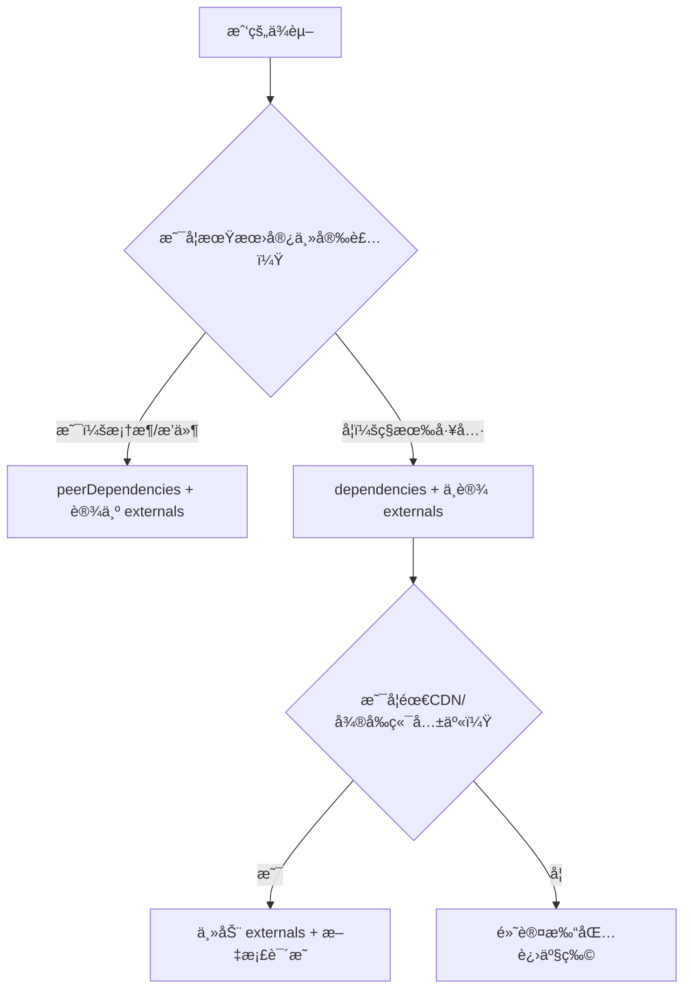

==================================================

peerDependencies 和 dependencies 到底有什么区别

==================================================

在 npm çš„ `package.json` 文件中，`dependencies` å’Œ `peerDependencies` 都用äºç®¡ç†ä¾èµ–，但它们的用途和行为有本质区别：

---

### **1. dependencies**
- **用途**：声æ˜å½“å‰åŒ…**ç›´æ¥ä¾èµ–**的第三方库。  
- **安装行为**：  
  - 当用户安装你的包时，这些ä¾èµ–会被**自动安装**到你的 `node_modules` 中。  
  - 如æœä¾èµ–库有多个版本，npm/yarn 会通过嵌套安装解决冲çªï¼ˆä¸åŒåŒ…å¯ä½¿ç”¨å„自兼容的版本）。  
- **适用场景**：  
  你的包**è¿è¡Œæ—¶å¿…é¡»**的库（例如 `lodash`ã€`axios` 等）。  
- **示例**：  
  ```json
  {
    "dependencies": {
      "lodash": "^4.17.0"
    }
  }
  ```

---

### **2. peerDependencies**
- **用途**：声æ˜å½“å‰åŒ…**需è¦å®¿ä¸»ç¯å¢ƒæä¾›**çš„ä¾èµ–（通常是共享库）。  
- **安装行为**：  
  - **ä¸ä¼šè‡ªåŠ¨å®‰è£…**这些ä¾èµ–ï¼  
  - 如æœç”¨æˆ·å®‰è£…你的包时，宿主ç¯å¢ƒ**没有安装**指定的ä¾èµ–（或版本ä¸å…¼å®¹ï¼‰ï¼Œä¼šæŠ›å‡ºè­¦å‘Šï¼ˆnpm <7）或错误（npm ≥7）。  
  - 用户必须**手动安装**这些ä¾èµ–到宿主项目中。  
- **设计目的**：é¿å…**é‡å¤å®‰è£…**å’Œ**版本冲çª**（强制共享åŒä¸€ä»½ä¾èµ–）。  
- **适用场景**：  
  - æ’件类库（如 `webpack-plugin` 需è¦å…±äº«å®¿ä¸»é¡¹ç›®çš„ `webpack`）。  
  - 组件库（如 React 组件库需è¦å…±äº«å®¿ä¸»é¡¹ç›®çš„ `react`）。  
- **示例**：  
  ```json
  {
    "peerDependencies": {
      "react": ">=16.8.0"
    }
  }
  ```

---

### **关键区别总结**
| 特性                | dependencies                  | peerDependencies                     |
|---------------------|------------------------------|--------------------------------------|
| **安装行为**        | 自动安装到当å‰åŒ… `node_modules` | ä¸è‡ªåŠ¨å®‰è£…，需宿主ç¯å¢ƒæä¾›             |
| **版本冲çªè§£å†³**    | å…许嵌套多版本                | 强制宿主ç¯å¢ƒå…±äº«å•ç‰ˆæœ¬               |
| **适用场景**        | ç§æœ‰ä¾èµ–（仅当å‰åŒ…需è¦ï¼‰       | 公共ä¾èµ–（需ä¸å®¿ä¸»å…±äº«ï¼‰             |
| **用户责任**        | 无需手动æ“作                  | 必须确ä¿å®¿ä¸»ç¯å¢ƒå®‰è£…正确版本         |
| **å…¸å‹ç”¨ä¾‹**        | `axios`, `lodash` 等工具库    | React 组件库ã€Webpack æ’件等         |

---

### **ä¸ºä»€ä¹ˆéœ€è¦ peerDependencies？**
å‡è®¾ä½ å¼€å‘一个 React 组件库：
- 如æœå°†å…¶æ”¾å…¥ `dependencies`：  
  用户项目中å¯èƒ½å®‰è£…**两份 React**（你的组件库内一份 + 用户项目一份），导致打包体积å¢å¤§ï¼Œç”šè‡³å¼•å‘ React 上下文错乱。  
- 使用 `peerDependencies`：  
  强制组件库ä¸å®¿ä¸»é¡¹ç›®**共享åŒä¸€ä»½ React**，é¿å…é‡å¤å®‰è£…和版本冲çªã€‚

---

### **npm 版本差异**
- **npm v3-v6**：åªå¯¹ç¼ºå¤±çš„ `peerDependencies` 输出警告，ä¸é˜»å¡å®‰è£…。  
- **npm v7+**：自动安装 `peerDependencies`（但è¦æ±‚版本范围兼容），ä¸å…¼å®¹åˆ™æŠ¥é”™ã€‚  
- **Yarn**：默认ä¸å®‰è£…，需é…åˆ `yarn install --flat` 或显å¼æ·»åŠ åˆ°å®¿ä¸»ä¾èµ–。

---

### **最佳å®è·µ**
1. **库/æ’件开å‘者**：  
   - 将核心框æ¶ï¼ˆå¦‚ Reactã€Vueã€Webpack）放入 `peerDependencies` + `devDependencies`（用äºæœ¬åœ°æµ‹è¯•ï¼‰ã€‚  
   - ç§æœ‰å·¥å…·åº“放入 `dependencies`。  
2. **应用开å‘者**：  
   - ç›´æ¥ç®¡ç†æ‰€æœ‰ä¾èµ–（包括 `peerDependencies` è¦æ±‚的库），无需特殊æ“作。

通过正确使用两者，å¯æ˜¾è‘—é¿å…ä¾èµ–冲çªå’Œå†—余安装问题。

==================================================

它们在打包的时候有没有什么区别

==================================================

在打包过程中（如使用 Webpackã€Rollup 等工具），`dependencies` å’Œ `peerDependencies` 的处ç†æ–¹å¼æœ‰æ˜¾è‘—区别，直æ¥å½±å“最终产物的体积和è¿è¡Œæ–¹å¼ï¼š

---

### **1. dependencies 的打包行为**
- **默认打包进产物**  
  工具会将 `dependencies` 中的模å—视为**ç§æœ‰ä¾èµ–**，直æ¥æ‰“包进最终输出文件（如 `dist/main.js`）。
- **é‡å¤æ‰“包é£é™©**  
  如æœå¤šä¸ªåº“ä¾èµ–åŒä¸€ä¸ªåŒ…（如 `lodash`），æ¯ä¸ªåº“都会将自己的 `lodash` 打包进产物，导致：
  ```bash
  final-bundle.js
  ├── LibraryA 的 lodash v4.17.0 (50KB)
  └── LibraryB çš„ lodash v4.17.0 (50KB)  # é‡å¤ï¼
  ```
- **适用场景**  
  适åˆ**ä¸æœŸæœ›å®¿ä¸»ç¯å¢ƒæä¾›**çš„ç§æœ‰å·¥å…·åº“（如内部å°è£…çš„ `utils` 等）。

---

### **2. peerDependencies 的打包行为**
- **默认æ’除在产物外**  
  打包工具会将 `peerDependencies` 视为**外部ä¾èµ–**（externals），**ä¸ä¼šæ‰“包进最终产物**。
- **ä¾èµ–宿主ç¯å¢ƒæä¾›**  
  在代ç ä¸­ä¿ç•™ `import` 语å¥ï¼Œè¿è¡Œæ—¶ä»å®¿ä¸»ç¯å¢ƒçš„ `node_modules` 加载：
  ```js
  // 打包å代ç ä¿ç•™åŸå§‹å¯¼å…¥
  import React from 'react'; // ä»å®¿ä¸»é¡¹ç›®è·å–
  ```
- **é¿å…é‡å¤æ‰“包**  
  ç¡®ä¿å¤šä¸ªåº“共享宿主ç¯å¢ƒçš„åŒä¸€ä»½ä¾èµ–：
  ```bash
  final-bundle.js
  ├── YourComponentLib (ä¸å« React)
  └── HostProject 的 react v18.2.0 (120KB)  # 仅一份
  ```

---

### **关键打包差异对比**
| 特性                     | dependencies                          | peerDependencies                     |
|--------------------------|---------------------------------------|--------------------------------------|
| **是å¦æ‰“包进产物**       | ✅ 是                                 | ⌠å¦ï¼ˆé»˜è®¤ï¼‰                        |
| **打包工具é…ç½®**         | è‡ªåŠ¨åŒ…å«                              | 需é…为 `externals` (或自动识别)      |
| **产物体积影å“**         | å¢å¤§ä½“积（å¯èƒ½é‡å¤ï¼‰                  | ä¸å¢åŠ ä½“积                           |
| **è¿è¡Œæ—¶ä¾èµ–æ¥æº**       | 当å‰åŒ…çš„ `node_modules`               | 宿主项目的 `node_modules`            |
| **å…¸å‹åœºæ™¯**             | ç§æœ‰å·¥å…·å‡½æ•°ã€å†…部库                  | 框æ¶ç»„件(React/Vue)ã€æ’件(Webpack)   |

---

### **打包é…置示例（Webpack）**
```js
// webpack.config.js（组件库é…置）
module.exports = {
  externals: {
    // 关键：将 peerDependencies 设为外部ä¾èµ–
    react: 'react',
    'react-dom': 'react-dom'
  }
};
```

---

### **为什么 peerDependencies 需è¦ç‰¹æ®Šæ‰“包处ç†ï¼Ÿ**
以 React 组件库为例：
1. **é¿å…é‡å¤æ‰“包**  
   若将 React 打包进组件库，用户项目会åŒæ—¶å­˜åœ¨ï¼š
   - 组件库内的 React (50KB)
   - 用户项目的 React (50KB)
   → **总体积å¢åŠ  100KB**

2. **é¿å…上下文冲çª**  
   React ä¾èµ–全局上下文（如 `React.createContext`），多个 React å®ä¾‹ä¼šå¯¼è‡´ï¼š
   ```js
   // 用户项目
   import React from 'react'; // 版本 18
   
   // 组件库内部
   import React from 'react'; // 版本 17 (已打包进组件)
   
   // 导致 Contextã€Hooks ç­‰ API 失效
   ```

---

### **peerDependencies 的打包注æ„事项**
1. **å¼€å‘ç¯å¢ƒç‰¹æ®Šå¤„ç†**  
   在组件库的本地开å‘中，需将 `peerDependencies` 安装到 `devDependencies`：
   ```json
   {
     "peerDependencies": {
       "react": ">=16.8"
     },
     "devDependencies": {
       "react": "^18.2.0" // 用äºæœ¬åœ°æµ‹è¯•å’Œæ‰“包
     }
   }
   ```

2. **Tree Shaking 优化**  
   当 `peerDependencies` 设为外部ä¾èµ–时，宿主项目的打包工具å¯å¯¹å…±äº«åº“åš Tree Shaking。

3. **动æ€ä¾èµ–警告**  
   若代ç åŠ¨æ€åŠ è½½ peer ä¾èµ–（如 `require('react/' + path)`），需显å¼é…ç½® externals：
   ```js
   // Webpack é…ç½®
   externals: {
     react: {
       commonjs: 'react',
       commonjs2: 'react',
       amd: 'react'
     }
   }
   ```

---

### **总结：打包决策指å—**
| **你的包类å‹**       | **ä¾èµ–ç±»å‹**          | **打包建议**                         |
|----------------------|-----------------------|--------------------------------------|
| 应用项目             | 所有ä¾èµ–              | 全部打包进产物                       |
| 公共组件库/æ’件      | 框æ¶(React/Vue ç­‰)    | peerDependencies + 设为 externals    |
| 公共组件库/æ’件      | ç§æœ‰å·¥å…·(如内部 utils)| dependencies + 打包进产物            |
| 独立è¿è¡Œçš„工具库     | 所有必需ä¾èµ–          | dependencies + 打包进产物            |

正确区分两者å¯é¿å… **“打包体积膨胀â€** å’Œ **“多å®ä¾‹å†²çªâ€** 两大核心问题。

==================================================

看起æ¥è¿™ä¸ªæŠŠ peerDependencies 设为 externals 的步骤是手动执行的，那如æœä¸€èˆ¬çš„ dependencies 也设为 externals，打包的时候有区别å—

==================================================

你说得é常对ï¼**å°† `peerDependencies` 设为 `externals` ç¡®å®æ˜¯æ‰‹åŠ¨é…置的**，而 `dependencies` 默认是会被打包的。但如æœ**主动将 `dependencies` 也设为 `externals`**，打包行为会å‘生å˜åŒ–，但è¿è¡Œæ—¶ä¼šäº§ç”Ÿå…³é”®å·®å¼‚。下é¢é€šè¿‡å¯¹æ¯”帮你彻底ç†æ¸…：

---

### é…置对比å®éªŒï¼ˆå‡è®¾æ‰“包工具为 Webpack）
#### 场景设定：
```json
// package.json
{
  "name": "my-library",
  "dependencies": {
    "lodash": "^4.17.0"     // ç§æœ‰å·¥å…·
  },
  "peerDependencies": {
    "react": ">=16.8"       // 共享框æ¶
  }
}
```

#### 1. **默认行为（ä¸é…ç½® externals）**
| ä¾èµ–ç±»å‹          | 是å¦æ‰“包进产物 | è¿è¡Œæ—¶æ¥æº               | é£é™©                     |
|-------------------|----------------|--------------------------|--------------------------|
| `dependencies`    | ✅ 是          | 当å‰åº“çš„ `node_modules`  | æ—                        |
| `peerDependencies`| âŒ å¦          | 宿主项目的 `node_modules`| **宿主未安装则报错**     |

#### 2. **手动将 `lodash` (dependencies) 设为 externals**
```js
// webpack.config.js
module.exports = {
  externals: {
    lodash: 'lodash'  // 关键：强制外部化
  }
};
```

| ä¾èµ–ç±»å‹          | 是å¦æ‰“包进产物 | è¿è¡Œæ—¶æ¥æº               | é£é™©                                |
|-------------------|----------------|--------------------------|-------------------------------------|
| `dependencies`    | âŒ å¦          | 宿主项目的 `node_modules`| **宿主未安装则报错**                |
| `peerDependencies`| âŒ å¦          | 宿主项目的 `node_modules`| **宿主未安装则报错**                |

---

### 关键区别解æ
#### 🔥 核心差异：**安装责任方ä¸åŒ**
| ä¾èµ–ç±»å‹          | 设为 externals åçš„å®é™…行为                          | 责任方       |
|-------------------|------------------------------------------------------|--------------|
| `peerDependencies`| 符åˆé¢„期，宿主**必须安装**（本æ¥å°±æ˜¯å®¿ä¸»è´£ä»»ï¼‰       | ✅ åˆç†      |
| `dependencies`    | **转å«è´£ä»»**，宿主**æ„外承担**了本ä¸è¯¥å®‰è£…çš„ä¾èµ–     | ⌠ä¸åˆç†    |

#### âš ï¸ é£é™©ç¤ºæ„图：
```mermaid
graph LR
    A[宿主项目] --> B[使用 my-library]
    B --> C{ä¾èµ–检查}
    C -->|éœ€è¦ react| D[宿主已安装]    %% peerDependency åˆç†
    C -->|éœ€è¦ lodash| E[宿主未安装]   %% dependency 外部化导致错误
    E --> F[è¿è¡Œæ—¶å´©æºƒï¼šCannot find module 'lodash']
```

---

### 为什么ä¸èƒ½éšæ„å°† dependencies 外部化？
#### 1. **ç ´åå°è£…性**
   - 你的库宣称：â€æˆ‘自带 `lodash`，用户无需关心“
   - 但外部化åå®é™…å˜æˆï¼šâ€æˆ‘用 `lodash`，但用户得自己装“
   - **相当äºæŠŠç§æœ‰ä¾èµ–å˜æˆäº†éšå½¢çš„ peerDependency**

#### 2. **版本冲çªé£é™©**
   - 你的库测试的是 `lodash@4.17.0`
   - 宿主项目装了 `lodash@3.0.0`（旧版缺少æŸäº› API）
   - **è¿è¡Œæ—¶æŠ¥é”™**：`this.merge is not a function`（å®é™…是 `_.merge` 在 v3 ä¸å­˜åœ¨ï¼‰

#### 3. **安装语义混淆**
   - 用户看到 `package.json` 中åªæœ‰ `"my-library": "^1.0.0"`
   - 安装åå´è¦æ±‚手动装 `lodash`（用户：？？？）

---

### 何时å¯ä»¥ä¸»åŠ¨å¤–部化 dependencies？
#### ✅ åˆç†åœºæ™¯ï¼š
1. **å¾®å‰ç«¯å…±äº«ä¾èµ–**  
   主应用已通过 `<script>` 全局暴露 `lodash`，å­åº”用å¤ç”¨ï¼š
   ```js
   // webpack.config.js
   externals: {
     lodash: '_' // 映射到全局å˜é‡
   }
   ```

2. **CDN ä¾èµ–优化**  
   大å‹åº“（如 three.js）通过 CDN 引入：
   ```html
   <!-- 宿主 HTML -->
   <script src="https://cdnjs.cloudflare.com/ajax/libs/three.js/r128/three.min.js"></script>
   ```
   ```js
   // webpack.config.js
   externals: {
     'three': 'THREE'
   }
   ```

#### ⛔ 错误场景：
```js
// å模å¼ï¼šå°†ç§æœ‰å·¥å…·åº“外部化
externals: {
  'internal-utils': 'internalUtils' // 宿主根本ä¸çŸ¥é“è¦è£…它ï¼
}
```

---

### 最佳å®è·µæ€»ç»“
| æ“作                     | æ¨è度 | è¯´æ˜                                                                 |
|--------------------------|--------|----------------------------------------------------------------------|
| peerDependencies + externals | â­â­â­â­â­ | 标准åšæ³•ï¼Œé¿å…é‡å¤æ‰“包框æ¶ä¾èµ–                                       |
| dependencies ä¸å¤„ç†      | â­â­â­â­â­ | ç§æœ‰ä¾èµ–应打包进产物，ä¿æŒå°è£…性                                     |
| dependencies + externals | â­â˜†     | 仅在宿主**æ˜ç¡®å…¨å±€æä¾›**时使用（如 CDN/å¾®å‰ç«¯ï¼‰ï¼Œéœ€å¼ºçº¦å®š            |
| peerDependencies ä¸å¤–部化 | âš ï¸ ç¦æ­¢ | 会导致框æ¶è¢«æ‰“包进库，引å‘é‡å¤å®‰è£…和上下文错乱                       |

---

### 终æ决策树


**简å•è¯´ï¼š**  
`peerDependencies` + `externals` = â€æˆ‘用宿主的ç¯å¢ƒâ€œ  
`dependencies` ä¸å¤„ç† = â€æˆ‘自带干粮，自给自足“

==================================================

